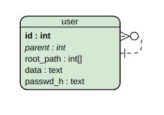

# JanuszeX API

### Diagram ER

### Więzy

Więzy w tabeli będą wyglądały mniej więcej tak:

`CREATE TABLE users(
    id int primary key not null, 
    parent int references users(id) on delete cascade,
    ancestors int[] not null,
    data varchar(100), 
    passwd_h text not null
);`

Hasła będą hashowane z solą z użyciem modułu `pgcrypto`.

Zastanawiam się czy root powinien mieć jako parent siebie samego, czy NULL. 
Na razie zostanę przy NULL, ale możliwe, że w trakcie implementacji zmienię i dodam więz `parent int not null`.

### Uprawnienia

Rozumiem, że skoro użytkownik init już istnieje, to ma ustawione uprawnienia.
Powinien móc wykonywać dowolne operację w bazie danych student.
Użytkownik app którego stworzę będzie miał następujące uprawnienia:

`CREATE USER app WITH ENCRYPTED PASSWORD 'qwerty';
GRANT CONNECT ON DATABASE student to app;
GRANT SELECT, INSERT, UPDATE, REFERENCES ON TABLE users TO app;`

Wydaje mi się, że jest to minimalny zestaw uprawnień jaki będzie potrzebny.

### Krótkie omówienie niektórych funkcji API (oczywiste funkcje pomijam)

* open - łączę się z bazą jako użytkownik `init` i wykonuję na bazie plik .sql który inicjalizuje bazę.
* new - dodaję nowego użytkownika a trigger ustawia temu użytkownikowi odpowiedni `root_path`
* remove - usuwając jednego pracownika z bazy automatycznie usuwa się całę poddrzewo ponieważ na kluczu obcym jest opcja `on delete cascade` 
* ancestor - sprawdzam zawieranie się w sobie `root_path`  użytkowników za pomocą operatora `@>` (nie muszę prefiksu bo to jest drzewo).
* reszta - w trywialny sposób korzystając z tego, że ancestor działa jako zawieranie się `root_path` w sobie.

W funkcjach api które wymagają autoryzacji, najpierw przeprowadzam autoryzację sprawdzając czy hash hasła się 
zgadza z obecnym w bazie (wykonuję odpowiedni select i sprawdzam ile wierszy zwrócił).
Tak samo jeśli muszę najpierw sprawdzić czy `emp1` może wykonać jakąś akcję względem `emp2` zależącą od relacji ancestor między nimi, to sprawdzam ją w opisany wyżej sposób.

### Różne

Załączam również bardzo wstępną wersję początkowo odpalanego pliku .sql, dla uzyskania lepszego obrazu struktury bazy.